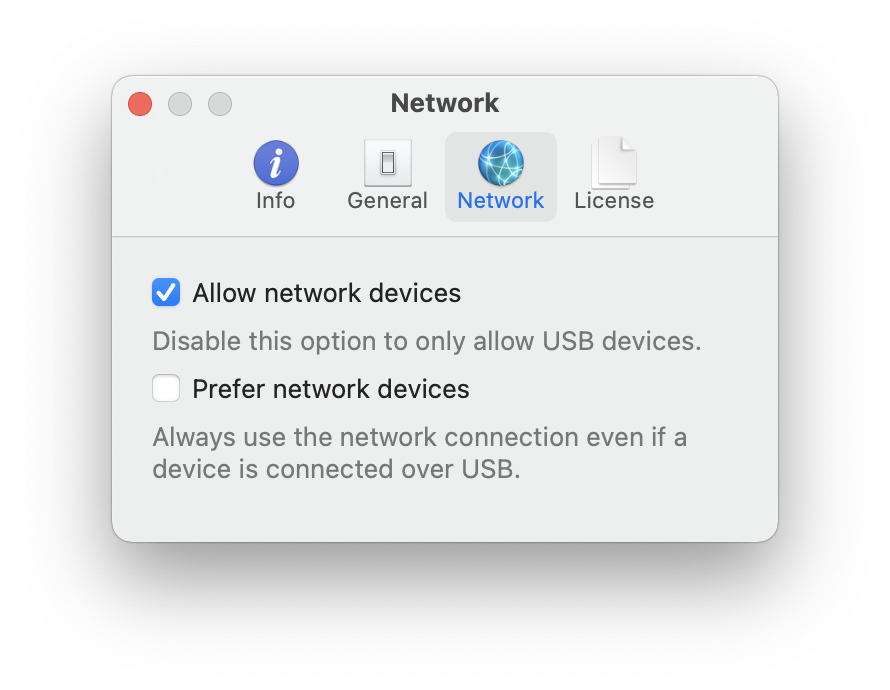

> **Warning**:    
> I do not support beta versions of iOS or macOS ! You can nevertheless try [the following](https://github.com/Schlaubischlump/LocationSimulator/issues/128#issuecomment-1179526935) to fix your problems. Replace iOS 16.0 with whatever iOS version you are using.

> **Note**:   
> If you use iOS 16 or greater you need to enable DeveloperMode first. You need to connect your device to Xcode in order for DeveloperMode to show up inside settings. You can read the following [issue](https://github.com/Schlaubischlump/LocationSimulator/issues/128) for more infornations.

[](https://opensource.org/licenses/gpl-3.0) 
[](https://www.paypal.com/donate/?hosted_button_id=9NR3CLRUG22SJ)

<div align="center">
  
  <h2 align="center">LocationSimulator</h2>
</div>

LocationSimulator is a macOS app (10.15.x, 11.x, 12.x) which allows spoofing the location of an iOS or iPhoneSimulator device. The target audience of this project are developers who want to test their location service based application. I do not encourage the use of this application to cheat in iOS games and I do not provide support for these games. If you use this application outside of the intended purposes, you are on your own.


- [Background](#background)
- [Features](#features)
- [Install](#install)
- [Build](#build)
    - [Requirements](#requirements)
    - [Build the app](#build-the-app)
- [Usage](#usage)
    - [Start spoofing](#start-spoofing)
    - [Moving](#moving)
    - [Stop spoofing](#stop-spoofing)
- [License](#license)
- [Contribute](#contribute)
- [Donate](#donate)
- [Enhancement ideas](#enhancement-ideas)

## Background

While I originally planed to build upon the fantastic work of [Watanabe Toshinori](https://github.com/watanabetoshinori) [LocationSimulator](https://github.com/watanabetoshinori/LocationSimulator/issues) I decided to recreate and change the whole project because of the projects (back then 18.08.19) missing [license](https://github.com/watanabetoshinori/LocationSimulator/issues/5). I created all necessary images and source code files and removed all dependencies except for [libimobiledevice](https://github.com/libimobiledevice/libimobiledevice). Even [Xcode](https://apps.apple.com/us/app/xcode/id497799835?mt=12) is not required anymore. You just need the `DeveloperDiskImage.dmg` and `DeveloperDiskImage.dmg.signature` files for your iOS Version.

## Features

- [x] Spoof the iOS device location without a jailbreak or installing an app on the device.
- [x] Spoof the iPhoneSimulator device location.
- [x] Automatically try to download the DeveloperDiskImage files for your iOS Version.
- [x] Set the device location with a long click on the map.
- [x] Support custom and predefined (Walk/Cycle/Drive) movement speeds.
- [x] Control the movement using the arrow keys.
- [x] Navigate from the current location to a new location.
- [x] Support network devices.
- [x] Search for locations.
- [x] Support dark mode.

> **Note**:    
> LocationSimulator will try to download the corresponding `DeveloperDiskImage.dmg` and `DeveloperDiskImage.dmg.signature` for your iOS Version from github, since I can not legally distribute these files. If the download should not work, get the files by installing Xcode and copy or link them to:    
> 
>```
>~/Library/Application Support/LocationSimulator/{YOUR_PLATFORM}/{MAJOR_YOUR_IOS_VERSION}.{MINOR_YOUR_IOS_VERSION}/
>```    
> `YOUR_PLATFORM` might be `iPhone OS` (iPhone and iPad), `Watch OS` (Apple Watch) or `Tv OS` (Apple TV). `MAJOR_YOUR_IOS_VERSION` might `14` and `MINOR_YOUR_IOS_VERSION` might be `3` for a device running iOS 14.3.
>
> As of v0.1.8 this folder moved to: 
>```
>~/Library/Containers/com.schlaubi.LocationSimulator/Data/Library/Application Support/LocationSimulator/
>```
> As of v0.1.9 you can manage these files using the `DeveloperDisk` preferences tab.

## Install

Download the latest [release](https://github.com/Schlaubischlump/LocationSimulator/releases) build from github to get the latest changes or

1. Install [homebrew](https://brew.sh) by entering the following command in your terminal: 

	```shell
	/bin/bash -c "$(curl -fsSL https://raw.githubusercontent.com/Homebrew/install/master/install.sh)"
	```
2. Install LocationSimulator with [homebrew](https://brew.sh) using:

	```shell
	brew install locationsimulator
	```

## Build

Since this project has gotten quite big over time, I exported some of the code to other packages. The list below contains all additional projects I created to make this project possible. They should all be downloaded automatically by swift:   
 
- [LocationSimulator-Localization](https://github.com/Schlaubischlump/LocationSimulator-Localization): The LocationSimulator localization files.    
- [LocationSimulator-Help](https://github.com/Schlaubischlump/LocationSimulator-Help): The LocationSimulator helpbook you see when you click on `Help` -> `LocationSimulator Help`.    
- [LocationSpoofer](https://github.com/Schlaubischlump/LocationSpoofer): The backend code used to spoof the location of iOS or iPhoneSimulator devices.     
- [XCF](https://github.com/Schlaubischlump/XCF): The low level frameworks used by LocationSpoofer.    
- [CLogger](https://github.com/Schlaubischlump/CLogger): A C / Objective-C / Swift logging library used by LocationSpoofer and LocationSimulator.    
- [SuggestionPopup](https://github.com/Schlaubischlump/SuggestionPopup): A simple Apple maps like popup list UI written for AppKit to search for locations.    
- [Downloader](https://github.com/Schlaubischlump/Downloader): A simple swift library to download files from the internet more easily.    
- [GPXParser](https://github.com/Schlaubischlump/GPXParser): A simple swift library to parse GPX files.

### Requirements

- macOS 10.15+
- macOS 11.x+ SDK
- swift 5.0+
- swift-tools-version 5.2+
- [jekyll](https://jekyllrb.com) (and a symlink of jekyll to `/usr/local/bin/jekyll`)

### Build the app

1. Install the latest [Xcode developer tools](https://developer.apple.com/xcode/downloads/) from Apple. (Using the AppStore is the easiest way)

2. Clone this repository:    

	```shell
	git clone --recurse-submodules https://github.com/Schlaubischlump/LocationSimulator
	```
3. Open `LocationSimulator.xcodeproj` in Xcode.
4. Let Xcode resolve all dependencies.
5. Tap `Run` to build and execute the app.

## Usage

### Allow network devices (optional):

<details>
	<summary>1. Make sure you can sync your device over Wi-Fi and access it inside the Finder.</summary>    

> **Sync your content using Wi-Fi**
>
>After you set up syncing with the Finder using USB, you can set up the Finder to sync to your device with Wi-Fi instead of USB.
>
>1. Connect your device to your computer with a USB cable, then open a Finder window and select your device. 
>
>2. Select “Show this [device] when on Wi-Fi." 
>
>3. Click Apply.
>
>When the computer and the device are on the same Wi-Fi network, the device appears in the Finder. The device syncs automatically whenever it's plugged in to power.
</details>

<details>
	<summary>2. Make sure that "LocationSimulator" -> "Preferences..." -> "Network" -> "Allow network devices" is enabled</summary>   
	
</details>

### Start spoofing:
  1. Connect the iOS device to your computer via USB or Wi-Fi.
  2. Select the device in the sidebar.
  3. Long click the point you want to set as the current location on the map.

### Moving:
  - Click the walk button at bottom left corner of the map. Drag the blue triangle to change the direction of movement.    
  	
  - Long click the walk button to enabled auto move. Click again to disable auto move.    
  	
  - Long click on a new point on the map while you are spoofing the location to show the navigation prompt or select the menu item to set the coordinates manually.    
    
  - Use the left and right arrow keys to change the direction of movement. Use up and down to move. Press space to stop the navigation.

### Stop spoofing:
  - Click the reset button.    
    

## License

The whole project is licensed under the [GNU General Public License version 3](LICENSE) unless specified otherwise in the specific subdirectories.

## Contribute
Since I maintain this project in my freetime, I always appreciate any help I get. Even if you are not a programmer and do not know anything about coding you can still help out. It would be great if more languages were available. If you know any other language and you are willing to invest some time to help with the translation let me know [here](https://github.com/Schlaubischlump/LocationSimulator/issues/65)! You can find the existing localization files [here](https://github.com/Schlaubischlump/LocationSimulator-Localization). I want this software to be as stable as possible, if you find any bug please report it by opening a new issue. If you are a programmer, feel free to contribute bug fixes or new features. It would be great if you run swift-lint on your code before submitting pull requests.

While you are here, consider leaving a Github star. It keeps me motivated. 

## Donate
Donations are always welcome! I will use the money to further develop the software in my free time and to fund the Apple Developer Membership to notarize the app. You can donate from inside the application or from the github page using the sponsor button. Choose `Help -> Donate...` or `LocationSimualtor -> Preferences -> Info -> Donate` to donate from inside the app. I'll add more donation options over time. Currently you can use PayPal or Ethereum. 

## Enhancement ideas
Look at the [`Projects`](https://github.com/Schlaubischlump/LocationSimulator/projects) tab to see a list of planned features for the next releases. 

## Acknowledgement
Special thanks to [@bailaowai](https://github.com/bailaowai) and his son for the Spanish and Chinese translation. [@Rithari](https://github.com/rithari) for the Italian translation, [@devmaximilian](https://github.com/devmaximilian) for his continuous contributions to the Swedish translation and [@Black-Dragon-Spirit](https://github.com/Black-Dragon-Spirit) for the dutch translation. Special thanks goes to [@bslatyer](https://github.com/bslatyer) as well for his debugging support and his quick responses, when new issues arise !
