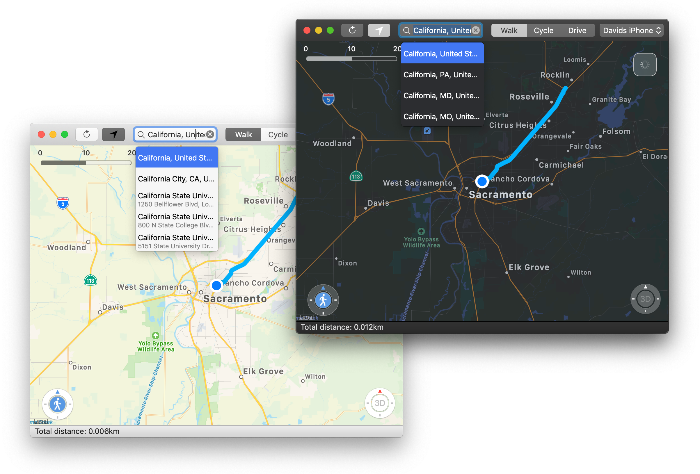
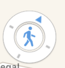
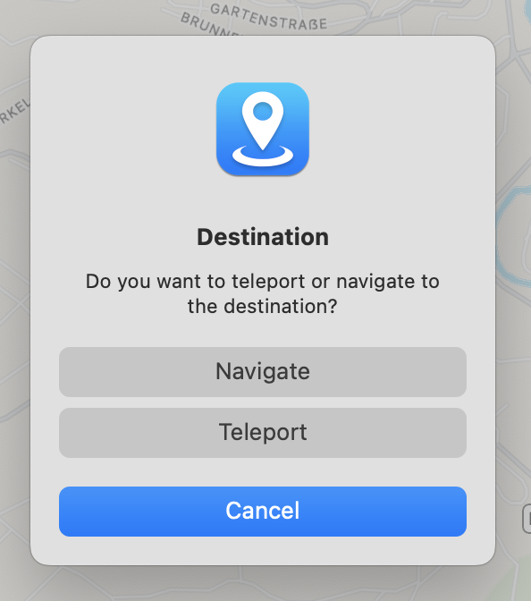

<div align="center">
  
  <h2 align="center">LocationSimulator</h2>
</div>


[](https://opensource.org/licenses/MIT)

LocationSimulator is a macOS app which allows spoofing the location of an iOS device. The main target audience of this project are developers who want to test their location service based application. Of course you might as well use this app to spoof your location inside [PokemonGo](https://www.pokemongo.com), but don't blame me if you get banned. The method used to spoof your location is basically the same used by [PokemonGo Webspoof](https://github.com/iam4x/pokemongo-webspoof) (except that Xcode is not required) or [iSpoofer](https://www.ispoofer.com).

- [Background](#background)
- [Features](#features)
- [Install](#install)
    - [With dependencies](#with-dependencies)
    - [Without dependencies](#without-dependencies)
- [Build](#build)
    - [Requirements](#requirements)
    - [Build the app](#build-the-app)
- [Usage](#usage)
    - [Start spoofing](#start-spoofing)
    - [Moving](#moving)
    - [Stop spoofing](#stop-spoofing)
- [License](#license)
- [Contribute](#contribute)
- [Enhancement ideas](#enhancement-ideas)

## Background

While I originally planed to build upon the fantastic work of [Watanabe Toshinoris](https://github.com/watanabetoshinori) [LocationSimulator](https://github.com/watanabetoshinori/LocationSimulator/issues) I decided to recreate and change the whole project because of the projects (back then) missing [license](https://github.com/watanabetoshinori/LocationSimulator/issues/5). I created all necessary images and source code files and removed all dependencies except for [libimobiledevice](https://github.com/libimobiledevice/libimobiledevice). Even [Xcode](https://apps.apple.com/us/app/xcode/id497799835?mt=12) is not required anymore. You just need the `DeveloperDiskImage.dmg` and `DeveloperDiskImage.dmg.signature` files for your iOS Version.

## Features

- [x] Spoof the iOS device location without a jailbreak or installing an app on the device.
- [x] Automatically try to download the DeveloperDiskImage files for your iOS Version.
- [x] Set the device location with a long click on the map.
- [x] Support 3 movement speeds (Walk/Cycle/Drive).
- [x] Control the movement using the arrow keys.
- [x] Navigate from the current location to a new location.
- [x] Support network devices.
- [x] Search for locations.
- [x] Support dark mode.

## Install

### With dependencies

1.  Go to [releases](https://github.com/Schlaubischlump/LocationSimulator/releases) and download the latest `LocationSimulator.app.zip` version.

2. Unzip the file and run the application by right clicking on it and granting a [Gatekeeper exception](https://support.apple.com/en-us/HT202491). 

### Without dependencies

1. Install [homebrew](https://brew.sh) by entering the following command in your terminal: 

	```shell
	/bin/bash -c "$(curl -fsSL https://raw.githubusercontent.com/Homebrew/install/master/install.sh)"
	```
2. Install the latest version of [libimobiledevice](https://github.com/libimobiledevice/libimobiledevice) with [homebrew](https://brew.sh) using:

	```shell
	brew install libimobiledevice
	```

3. Go to [releases](https://github.com/Schlaubischlump/LocationSimulator/releases) and download the latest `LocationSimulator_without_dependencies.app.zip` version.
4. Unzip the file and run the application by right clicking on it and granting a [Gatekeeper exception](https://support.apple.com/en-us/HT202491). 

> Note: If the app crashes on launch that means that either you made a mistake and installed an outdated version of the dependencies / LocationSimulator or I did not update the build for the latest homebrew release. If the later is the case or you can't distinguish between the two options open a new github issue, so that I can help you.

## Build

### Requirements

- macOS 10.13+
- Swift 5.0+
- [libimobiledevice](https://github.com/libimobiledevice/libimobiledevice)
	- [libusbmuxd](https://github.com/libimobiledevice/libusbmuxd)
	- [libplist](https://github.com/libimobiledevice/libplist)
	- [libopenssl](https://github.com/openssl/openssl)
	- [libcrypto](https://github.com/openssl/openssl)

> **Note**:    
> LocationSimulator will try to download the corresponding `DeveloperDiskImage.dmg` and `DeveloperDiskImage.dmg.signature` for your iOS Version from github, because I can not legally distribute these files. If the download should not work, get the files by installing Xcode and copy or link them to:    
> ```~/Library/Application Support/LocationSimulator/{MAJOR_YOUR_IOS_VERSION}.{MINOR_YOUR_IOS_VERSION}/```

### Build the app

1. Install the latest [Xcode developer tools](https://developer.apple.com/xcode/downloads/) from Apple. (Using the AppStore is the easiest way)
2. Install the latest version of [libimobiledevice](https://github.com/libimobiledevice/libimobiledevice) (and thereby all it's dependencies as well) with [homebrew](https://brew.sh):

	```shell
	brew install libimobiledevice
	```
3. Clone this repository:    

	```shell
	git clone --recurse-submodules https://github.com/Schlaubischlump/LocationSimulator
	```
4. Open `LocationSimulator.xcodeproj` in Xcode.
5. Tap `Run` to build and execute the app.

> **Note**:  
> If you want to build a standalone application which can be copied to another Mac without installing the dependencies choose the `LocationSimulator` scheme and switch the configuration to `Release` before running. If you do not want to bundle the dependencies, but want to create a release build choose the `Homebrew` scheme. When a new release of `libimobiledevice` is available, I will try to create a homebrew cask for this application. 

## Usage

### Start spoofing:
  1. Connect the iOS device to your computer via USB or Wi-Fi.
  2. Long click the point you want to set as the current location on the map.

### Moving:
  - Click the walk button at bottom left corner of the map. Drag the blue triangle to change the direction of movement.    
  	
  - Long click the walk button to enabled auto move. Click again to disable auto move.    
  	
  - Long click on a new point on the map while you are spoofing the location to show the navigation prompt or select the menu item to set the coordinates manually.    
    
  - Use the left and right arrow keys to change the direction of movement. Use up and down to move. Press space to stop the navigation.

### Stop spoofing:
  - Click the reset button.    
    

## License

The whole project is licensed under the [MIT License](LICENSE) unless specified otherwise in the specific subdirectories.

## Contribute
Help is always appreciated, wether it are bug fixes or features! E.g accessibility support is still to be implemented, especially for the popup menu.

## Enhancement ideas
- Allow following a predefined route from a gpx file
- Big Sur UI update
    - ~~New icon (done, just not pushed)~~
    - Replace the bottom bar (maybe with a transparent, hovering total distance label)
    - Extend the Mapview behind the toolbar
- If you have any other idea, let me know !
