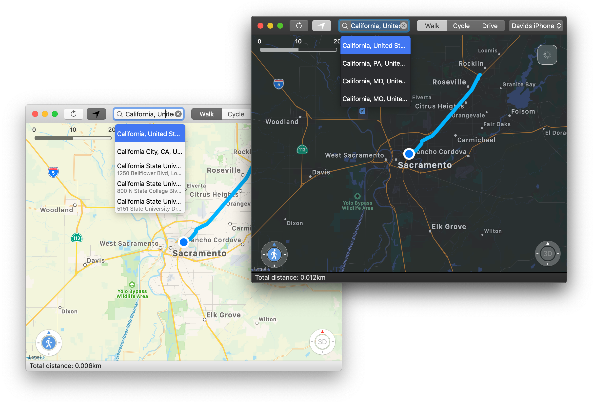
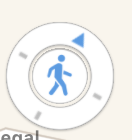
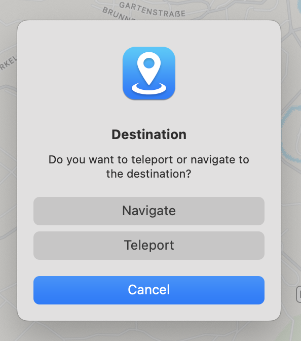
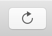
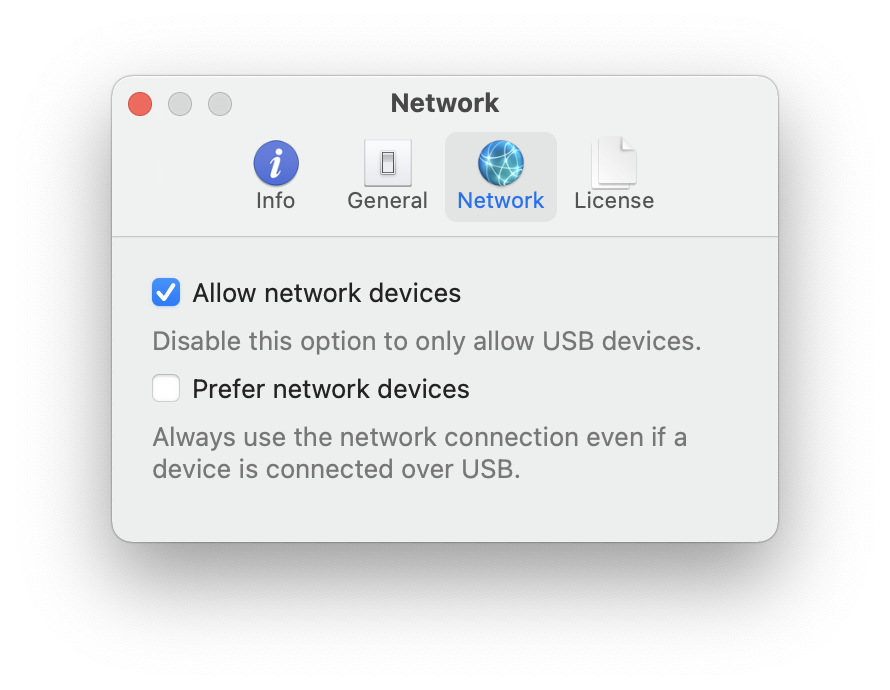

> [!WARNING]
> iOS 17 and later are not currently supported.
> For more details, click [here](https://github.com/Schlaubischlump/LocationSimulator/issues/171).

> [!NOTE]
> Beta versions of iOS/iPadOS/tvOS are not supported.

<p align="center">
  
</p>

# LocationSimulator

[](https://www.paypal.com/donate/?hosted_button_id=9NR3CLRUG22SJ)
[](https://opensource.org/licenses/gpl-3.0)

LocationSimulator is a macOS app that allows spoofing the location of an Apple device (iOS, iPadOS, tvOS). The target audience for this project is developers who want to test their location-service-based application(s). I do not encourage using this application to cheat in iOS games, and I do not provide support for these games. If you use this application outside of the intended purposes, you are on your own.



<details>
<summary><b>📚 Table of Contents</b></summary>

- [Background](#background)
- [Features](#features)
- [Install](#install)
- [Build](#build)
  - [Requirements](#requirements)
  - [Build the app](#build-the-app)
- [Usage](#usage)
  - [Start spoofing](#start-spoofing)
  - [Moving](#moving)
  - [Stop spoofing](#stop-spoofing)
- [License](#license)
- [Contribute](#contribute)
- [Donate](#donate)
- [Enhancements](#enhancements)
- [Acknowledgements](#acknowledgements)

</details>

## Background

While I originally planned to build on the fantastic work of [Watanabe Toshinori's LocationSimulator](https://github.com/watanabetoshinori/LocationSimulator), I decided to recreate the whole project because the original lacked a license at the time (August 2019). I created all necessary images and source code files and removed all third-party binary dependencies except for [libimobiledevice](https://github.com/libimobiledevice/libimobiledevice). The project uses several Swift packages (listed under [Build](#build)) but no longer requires [Xcode](https://apps.apple.com/us/app/xcode/id497799835?mt=12) to be installed at runtime. You need the `DeveloperDiskImage.dmg` and `DeveloperDiskImage.dmg.signature` files for your iOS version.

## Features

- Spoof the iOS device location without a jailbreak or installing an app on the device.
- Spoof the iPhoneSimulator device location.
- Automatically try to download the DeveloperDiskImage files for your iOS version.
- Set the device location with a long-click on the map.
- Support custom and predefined (Walk/Cycle/Drive) movement speeds.
- Control the movement using the arrow keys.
- Navigate from the current location to a new location.
- Support network devices.
- Search for locations.
- Support dark mode.

> [!NOTE]
> LocationSimulator will try to download the corresponding `DeveloperDiskImage.dmg` and `DeveloperDiskImage.dmg.signature` for your iOS version from GitHub, since I cannot legally distribute these files. If the download does not work, get the files by installing Xcode and copying or linking them to:
>
> ```
> ~/Library/Application Support/LocationSimulator/{YOUR_PLATFORM}/{MAJOR_YOUR_IOS_VERSION}.{MINOR_YOUR_IOS_VERSION}/
> ```
>
> `YOUR_PLATFORM` might be `iOS` (iPhone and iPad), `watchOS` (Apple Watch), or `tvOS` (Apple TV). `MAJOR_YOUR_IOS_VERSION` might be `14` and `MINOR_YOUR_IOS_VERSION` might be `3` for a device running iOS 14.3.
>
> As of v0.1.8, this folder has moved to:
>
> ```
> ~/Library/Containers/com.schlaubi.LocationSimulator/Data/Library/Application Support/LocationSimulator/
> ```
>
> As of v0.1.9, you can manage these files using the `DeveloperDisk` preferences tab.

## Install

Download the latest [release](https://github.com/Schlaubischlump/LocationSimulator/releases) build from GitHub to get the latest changes, or install via [Homebrew](https://brew.sh):

1. Install [Homebrew](https://brew.sh) by entering the following command in your terminal:

   ```shell
   /bin/bash -c "$(curl -fsSL https://raw.githubusercontent.com/Homebrew/install/HEAD/install.sh)"
   ```

2. Install LocationSimulator with [Homebrew](https://brew.sh) using:

   ```shell
   brew install --cask locationsimulator
   ```

## Build

Since this project has grown quite large over time, I have exported some of the code to other packages. The list below contains all additional projects I created to make this project possible. They should all be downloaded automatically by Swift:

- [LocationSimulator-Localization](https://github.com/Schlaubischlump/LocationSimulator-Localization): The LocationSimulator localization files.
- [LocationSimulator-Help](https://github.com/Schlaubischlump/LocationSimulator-Help): The LocationSimulator helpbook you see when you click on `Help` -> `LocationSimulator Help`.
- [LocationSpoofer](https://github.com/Schlaubischlump/LocationSpoofer): The backend code used to spoof the location of iOS or iPhoneSimulator devices.
- [XCF](https://github.com/Schlaubischlump/XCF): The low-level frameworks used by LocationSpoofer.
- [CLogger](https://github.com/Schlaubischlump/CLogger): A C / Objective-C / Swift logging library used by LocationSpoofer and LocationSimulator.
- [SuggestionPopup](https://github.com/Schlaubischlump/SuggestionPopup): A simple Apple Maps-like popup list UI written for AppKit to search for locations.
- [Downloader](https://github.com/Schlaubischlump/Downloader): A simple Swift library to download files from the internet more easily.
- [GPXParser](https://github.com/Schlaubischlump/GPXParser): A simple Swift library to parse GPX files.

### Requirements

- macOS 10.15+
- macOS 11.x+ SDK
- Swift 5.0+
- Swift Tools 5.2+
- [jekyll](https://jekyllrb.com) (required to build the helpbook; a symlink of jekyll to `/usr/local/bin/jekyll` is expected)

### Build the app

1. Install the latest [Xcode](https://developer.apple.com/xcode) from Apple. (Using the App Store is the easiest way)

2. Clone this repository:

   ```shell
   git clone --recurse-submodules https://github.com/Schlaubischlump/LocationSimulator
   ```

3. Open `LocationSimulator.xcodeproj` in Xcode.
4. Let Xcode resolve all dependencies.
5. Tap `Run` to build and execute the app.

## Usage

> [!TIP]
> If you use iOS 16 or later, you need to enable Developer Mode first. The Developer Mode option should appear in Settings the first time you try to use your device with LocationSimulator, after you receive a warning that you must enable Developer Mode. You can read the following [issue](https://github.com/Schlaubischlump/LocationSimulator/issues/128) for more information.

<details>
<summary><a name="start-spoofing"></a> 🏁 <b>Start Spoofing</b></summary><br>

- Connect the iOS device to your computer via USB or Wi-Fi.

- Select the device in the sidebar.

- Long-click the point you want to set as the current location on the map.

</details>

<details>
<summary><a name="moving"></a> 👟 <b>Moving</b></summary><br>

- Click the walk button at the bottom left corner of the map. Drag the blue triangle to change the direction of movement.

  

- Long-press the walk button to enable auto move. Click again to turn off auto move.

  

- Long-click on a new point on the map while you are spoofing the location to show the navigation prompt, or select the menu item to set the coordinates manually.

  

- Use the left and right arrow keys to change the direction of movement. Use up and down to move. Press space to stop the navigation.

</details>

<details>
<summary><a name="stop-spoofing"></a> 🛑 <b>Stop Spoofing</b></summary><br>

- Click the reset button.

  

</details>

> [!TIP]
> Follow the provided steps to enable spoofing over Wi-Fi.

<details>
<summary> 📶 <b>Network Access</b></summary><br>

After you set up syncing with the Finder over USB, you can configure the Finder to sync to your device over Wi-Fi instead of USB.

- Connect your device to your computer with a USB cable, then open a Finder window and select your device.
- Select "Show this [device] when on Wi-Fi."
- Click Apply.

When the computer and the device are on the same Wi-Fi network, the device appears in the Finder. The device syncs automatically whenever it's plugged in to power.

> ⚙️ Make sure that **LocationSimulator → Preferences... → Network → Allow network devices** is enabled.



</details>

## License

The whole project is licensed under the [GNU General Public License version 3](LICENSE) unless specified otherwise in the specific subdirectories.

## Contribute

Since I maintain this project in my free time, I always appreciate any help I get. Even if you are not a programmer and do not know anything about coding, you can still help out. It would be great if more languages were available - if you know another language and are willing to invest some time, please [open a translation request](https://github.com/Schlaubischlump/LocationSimulator/issues/65)! You can find the existing localization files [here](https://github.com/Schlaubischlump/LocationSimulator-Localization). I want this software to be as stable as possible; if you find any bugs, please report them by opening a new issue. If you are a programmer, feel free to contribute bug fixes or new features. Please run SwiftLint on your code before submitting pull requests.

While you are here, consider leaving a GitHub star - it keeps me motivated.

## Donate

Donations are always welcome! I will use the money to develop the software in my free time further and to fund the Apple Developer Membership to notarize the app. You can donate via [PayPal](https://www.paypal.com/donate/?hosted_button_id=9NR3CLRUG22SJ) or Ethereum, either from inside the app (`Help → Donate...` or `LocationSimulator → Preferences → Info → Donate`) or via the GitHub sponsor button on this page.

**🔑 Apple Developer Program** - Each year, every Apple Developer must pay a fee to Apple to sign their applications and access certain developer resources. If your application is not signed, the user will see numerous warnings that the program is malicious, and might need to grant special permissions to start the app.

**🖥️ Parallels Desktop for Mac** - To verify that LocationSimulator works on older macOS versions, I need to be able to run it on all of them. Since I only have a single Mac, I use Parallels Desktop for Mac to run multiple older versions of macOS simultaneously.

**🔍 Hopper Disassembler** - Hopper is a disassembler for macOS and Linux. You need to disassemble a program if the source code is closed-source, but you still want to figure out how it works. I often need a disassembler to reverse-engineer Apple's source code, e.g., when they change the API to interact with the iOS Simulator. Currently, I'm using the free version of Hopper, which requires a restart every 30 minutes. The commercial version does not have this limitation.

## Enhancements

Look at the [Projects](https://github.com/Schlaubischlump/LocationSimulator/projects) tab to see a list of planned features for the next releases.

## Acknowledgements

- [@bailaowai](https://github.com/bailaowai) and his son for Spanish and Chinese localization.
- [@Rithari](https://github.com/rithari) for the Italian localization.
- [@devmaximilian](https://github.com/devmaximilian) for the Swedish localization.
- [@Black-Dragon-Spirit](https://github.com/Black-Dragon-Spirit) for the Dutch localization.
- [@Chuck3CZ](https://github.com/Chuck3CZ) for the Czech localization.
- [@bslatyer](https://github.com/bslatyer) for debugging support and quick responses when new issues arise.
